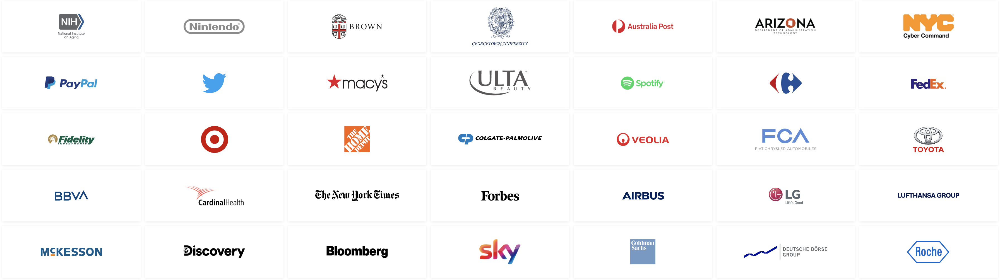
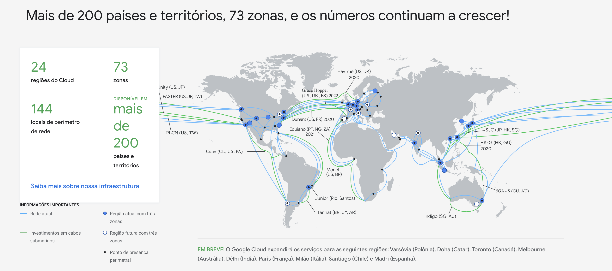

# Introdução

  <h2 align="center">Google Cloud Platform</h2>
  <h1 align="center"></h1>

[Próximo](./1.2-Conceitos.md) | [Home](../README.md)

## Bem-vindo!

Olá, seja bem-vindo ao curso de GoogleCloudPlatform4Noobs fornecido pela He4rt Developers. Estamos muito grato por você estar aqui conosco e tenho certeza que esse curso irá lhe fornecer os primeiros passos para usar serviços da Google Cloud Platform (GCP) em suas aplicações.

Nesse tutorial, irei falar de alguns serviços da GCP, quando usá-los e dar alguns exemplos práticos. Irei fornecer alguns exemplos de código no decorrer do curso, mas sinta-se livre par usar seus prórpios códigos.

## Google Cloud Platform

A GCP é uma plataforma de computação em nuvem oferecida pelo Google, que oferece diversos serviços para hosting de serviços, banco de dados, ferramentas de inteligência artificial, IoT, etc... Eles oferecem suloções [serverles](https://serverless-stack.com/chapters/pt/what-is-serverless.html), deploy de [containers](https://blog.geekhunter.com.br/docker-na-pratica-como-construir-uma-aplicacao/), serviços de [CI/CD](https://www.redhat.com/pt-br/topics/devops/what-is-ci-cd), host de banco de dados e muuuito mais.

### Clientes

Eles contam com um grande número de clientes, sendo a terceira maior plataforma de cloud do mundo (ficando atrás da Amazon Web Services e Microsoft Azure).

### Regiões

Possuem uma cobertura de infraestrutura de regiões enorme, fazendo com que seus aplicações não não sofram de latência.

### Integrações

Por oferecer diversos serviços de todos os tipos, a integração entre eles fica fácil, sendo possível ter uma solução completa hospedado na mesma plataforma. Se quiser saber mais sobre a GCP, dê uma olhada [aqui](https://cloud.google.com/why-google-cloud).

### Cobranças

Para usar os serviços da GCP você precisará de um cartão de crédito, mas não se preocupe, não será cobrado nada (desde que você extrapole os limites). O [free tier](https://cloud.google.com/free) inclui US$300,00 para você gastar em qualquer serviço por 90 dias. Caso você gaste esses US$300,00 ou passe esses 90 dias, os valores serão cobrados normalmente. Alguns produtos são gratuitos até certo limite especificado, que você pode conferir [aqui](https://cloud.google.com/free).

No [próximo capítulo](./1.2-Conceitos.md) veremos alguns conceitos gerais sobre a GCP.

[Próximo](./1.2-Conceitos.md) | [Home](../README.md)
