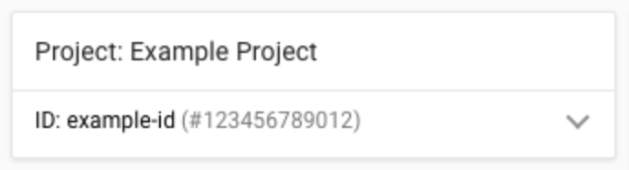

# Conceitos

  <h2 align="center">GoogleCloudPlatform4Noobs</h2>
  <h1 align="center"></h1>

[Anterior](./1.1-Introducao.md) | [Próximo](./1.3-SDK.md) | [Home](../README.md)

## Getting Started

Para iniciar, você precisará de uma conta Google. Faça login no [console](https://console.cloud.google.com/) da GCP, vá em [Billing](https://console.cloud.google.com/billing) e cria uma conta de cobranças, para que possamos usufruir de todos os serviços.

## Como a GCP Funciona

O Google Cloud é formado por conjunto de recursos físicos (computadores e unidades de disco rígido) e recursos virtuais, como máquinas virtuais, localizados nos data centers do Google por todo o mundo. Cada local do data center está em uma região. As regiões incluem Ásia, Austrália, Europa, América do Norte e América do Sul. Cada região é uma coleção de zonas, isoladas entre si dentro da região. Cada zona é identificada por um nome que combina um identificador de letra com o nome da região. Por exemplo, a zona a na região da Ásia Oriental é denominada asia-east1-a.

Essa distribuição de recursos oferece diversas vantagens, inclusive redundância em caso de falha e latência reduzida localizando recursos mais próximos dos clientes. Essa distribuição também introduz regras sobre como recursos podem ser usados juntos.

## Serviços

A Google Cloud oferece [diversos serviços](https://cloud.google.com/products) dos mais variados tipos, como banco de dados, pipelines de CI/CD, hosting de aplicações e a lista continua crescendo. Você pode mesclar diversos serviços e gerenciar de uma forma fácil. A [documentação](https://cloud.google.com/docs?hl=pt-br) também é bem completa, você consegue achar tudo facilmente.

## Projeto

Para começar a usar esses serviços, você precisa criar um projeto. Todos os recursos que você alocar, pertencem a um projeto. Ele possui os usuários, permissões, recursos e configurações que descrevem a sua aplicação.

Todo projeto possui esses três:

- Nome a sua escolha.

- ID gerado pela Google.

- Número de projeto gerado pela Google.

<h1 align="left"></h1>

Nesse exemplo:

- **Example Project** é o nome do projeto.

- **example-id** é o código do projeto.

- **123456789012** é o número do projeto.

## Interfaces

Existem duas principais formas de interagir com os serviços. Através da interface web no navegador e através do Cloud SDK no terminal. No decorrer do curso, estarei usando o SDK, para reduzir o tamanho dos tutoriais e a interface da GCP pode mudar ao decorrer dos anos. Nos próximos capitulos veremos como configurar o SDK.

No [próximo capítulo](./1.3-SDK.md) vamos instalar o Cloud SDK.

[Anterior](./1.1-Introducao.md) | [Próximo](./1.3-SDK.md) | [Home](../README.md)
