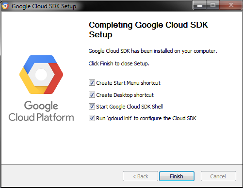

# Google Cloud SDK

<p align="center">
  <h2 align="center">GoogleCloudPlatform4Noobs</h2>
  <h1 align="center"></h1>
</p>

[Anterior](./1.2-Conceitos.md) | [Próximo](./1.4-Projeto.md) | [Home](../README.md)

## Instalando o SDK

Para gerenciarmos os serviços, podemos fazer direto do site da Google Cloud ou atrás de uma [CLI](https://cloud.google.com/sdk). A CLI esta disponível para Linux, MacOS e Windows, e você pode usá-las direto do seu terminal.

## Debian/Ubuntu

Adicione o URI de distribuição do SDK do Cloud como a origem do pacote:

```shell
sudo apt-get install apt-transport-https ca-certificates gnupg
```

Importe a chave pública do Google Cloud:

```shell
curl https://packages.cloud.google.com/apt/doc/apt-key.gpg | sudo apt-key --keyring /usr/share/keyrings/cloud.google.gpg add -
```

Atualize e instale o SDK do Cloud:

```shell
sudo apt-get update && sudo apt-get install google-cloud-sdk
```

Execute `gcloud init` para começar:

```shell
gcloud init
```

## Red Hat/Fedora/CentOS

Atualize o YUM com as informações de repositório do Cloud SDK:

```shell
sudo tee -a /etc/yum.repos.d/google-cloud-sdk.repo << EOM
[google-cloud-sdk]
name=Google Cloud SDK
baseurl=https://packages.cloud.google.com/yum/repos/cloud-sdk-el7-x86_64
enabled=1
gpgcheck=1
repo_gpgcheck=1
gpgkey=https://packages.cloud.google.com/yum/doc/yum-key.gpg
       https://packages.cloud.google.com/yum/doc/rpm-package-key.gpg
EOM
````

Instale o Cloud SDK:

```shell
yum install google-cloud-sdk
```

Execute gcloud init para começar:

```shell
gcloud init
```

## MacOS

Instale o Homebrew se você já não tiver:

```shell
/bin/bash -c "$(curl -fsSL https://raw.githubusercontent.com/Homebrew/install/master/install.sh)"
```

Instale o Cloud SDK:

```shell
brew install google-cloud-sdk
```

Execute gcloud init para começar:

```shell
gcloud init
```

## Windows

Faça o download do Instalador do SDK do Cloud:

```shell
(New-Object Net.WebClient).DownloadFile("https://dl.google.com/dl/cloudsdk/channels/rapid/GoogleCloudSDKInstaller.exe", "$env:Temp\GoogleCloudSDKInstaller.exe")

& $env:Temp\GoogleCloudSDKInstaller.exe
```

Inicie o instalador e siga as instruções. O instalador é assinado pela Google LLC.

O SDK do Cloud requer o Python. As versões compatíveis são 3.5 a 3.8 e 2.7.9 ou mais recentes.

O instalador implantará todas as dependências necessárias, incluindo a versão necessária do Python. Mesmo que o SDK do Cloud use atualmente o Python 3 por padrão, é possível usar uma instalação atual do Python ao desmarcar a opção "Instalar Bundled Python", se necessário.



Verifique se as opções abaixo estão selecionadas:

- Start Google Cloud SDK Shell (Iniciar Shell do SDK do Google Cloud)

- Run 'gcloud init' (Executar 'gcloud init')

O instalador inicia uma janela de terminal e executa o comando `gcloud init`.

A instalação padrão não inclui as extensões do App Engine necessárias para implantar um aplicativo usando comandos `gcloud`. Para instalar esses componentes, use o gerenciador de componentes do SDK do Cloud.

No [próximo capítulo](./1.4-Projeto.md) vamos criar um projeto.

[Anterior](./1.2-Conceitos.md) | [Próximo](./1.4-Projeto.md) | [Home](../README.md)
