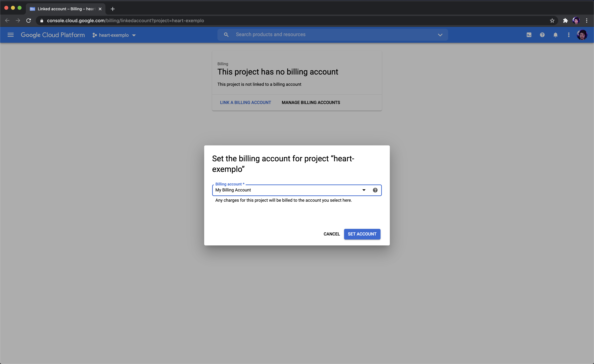

# Criando um Projeto

<p align="center">
  <h2 align="center">GoogleCloudPlatform4Noobs</h2>
  <h1 align="center"></h1>
</p>

[Anterior](./1.3-SDK.md) | [Próximo](./1.5-IAM.md) | [Home](../README.md)

Vamos começar a botar a mão na massa! Como foi dito anteriormente, vamos usar o terminal para interagir com os serviços da Google Cloud. Então abre seu terminal e siga os passos.

## Variáveis de Ambiente

> Quando você ver em um comando algo assim $EXEMPLO, de um $ seguido por uma palavra em maiúsculo, é uma variável de ambiente. Essas variáveis você pode exportar no seu terminal para facilitar o copiar e colar de comandos.

Essa será a variável que iremos usar:

```shell
PROJECT_ID
```

> O comando deve parecer dessa fora:
>
>```shell
> export PROJECT_ID=exemplo-heart
>```
>
> Vale lembrar que o PROJECT_ID deve ser um ID único

## Criando um projeto

Precisamos fazer login com a nossa conta da Google. Rode no terminal o seguinte comando, ele abrirá no seu navegador um página para fazer login com a sua conta do Google.

```shell
gcloud auth login
```

Agora vamos criar um projeto:

```shell
gcloud projects create $PROJECT_ID
```

Vamos selecionar o projeto que acabamos de criar. Devemos selecionar o projeto para quando rodarmos os comandos de serviços, ele saberá em qual projeto você esta se referindo.

```shell
gcloud config set project $PROJECT_ID
```

Agora vamos vincular um perfil de pagamento ao nosso projeto, para que possamos usar os serviços que geram cobranças. Ele abrirá uma página no seu navegador, link seu perfil lá:

```shell
open "https://console.cloud.google.com/billing/linkedaccount?project=$PROJECT_ID"
```



## Habilitando Serviços

Como a Google Cloud oferece diversos serviços, você deve ativá-los no seu projeto para começar. Por enquanto não usaremos nenhum serviço, mas para que você se familiarize com o comando, para ativar o Cloud Run por exemplo, seria assim:

```shell
gcloud services enable run.googleapis.com
```

Para desativar:

```shell
gcloud services disable run.googleapis.com
```

No [próximo capítulo](./1.5-IAM.md) veremos alguns conceitos sobre a permissões com IAM.

[Anterior](./1.3-SDK.md) | [Próximo](./1.5-IAM.md) | [Home](../README.md)
